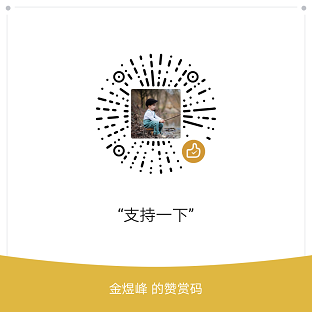

# mp-html

> 一个强大的小程序富文本组件

## 📢 概况 :id=overview
显示动态 *html* 富文本是很多应用必要的需求，小程序平台不支持 *dom* 操作使得这成为一个难题，其自带的 *rich-text* 组件支持的标签少且屏蔽所有事件，难以实际应用。因此就有了这样一个能够便捷的在小程序平台上处理富文本的组件，还支持丰富的扩展功能。  

## 📋 特性 :id=feature
- 支持在多个主流的小程序平台和 *uni-app* 中使用
- 支持丰富的标签（包括 *table*、*video*、*svg* 等）
- 支持丰富的事件效果（自动预览图片、链接处理等）
- 支持设置占位图（加载中、出错时、预览时）
- 支持锚点跳转、长按复制等丰富功能
- 支持大部分 *html* 实体
- 丰富的插件（关键词搜索、内容 **编辑** 等）
- 效率高、容错性强且轻量化（*≈24.5KB*，*9KB gzipped*）

查看 [功能介绍](overview/feature) 了解更多

## 🎉 使用案例 :id=case
官方示例（富文本插件）  

| 欢喜商城 | 多么生活 | 米兔旅行 | 全品作业小助手 | 古典文学名著阅读 | 食法查 |
|:---:|:---:|:---:|:---:|:---:|:---:|
|  |  |  |  |  |  |

| APP 比比 | 源创智造 | 程序员技术之旅 | Geek 时代 | 备忘录与记事本 | 优秀笔记 |
|:---:|:---:|:---:|:---:|:---:|:---:|
|  |  |  |  |  |  |

以上排名不分先后，更多可见 [使用案例收集](https://github.com/jin-yufeng/mp-html/issues/27)（欢迎添加）  

## 🎈 赞赏支持 :id=sponsor

## 📃 许可 :id=license
[MIT License](https://github.com/jin-yufeng/mp-html/blob/master/LICENSE)  

?> 您可以免费的使用（包括商用）、复制或修改本组件  

!> 不得用于任何违法用途  
在用于生产环境前，务必进行仔细测试，由本组件 *bug* 带来的损失概不负责  

---
Powered by docsify