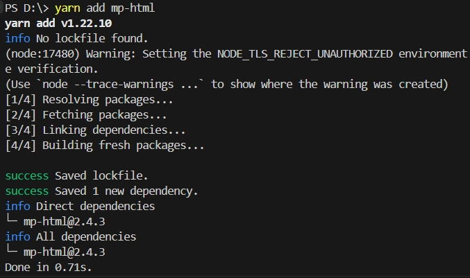
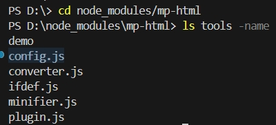
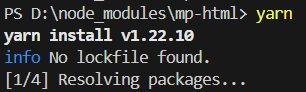
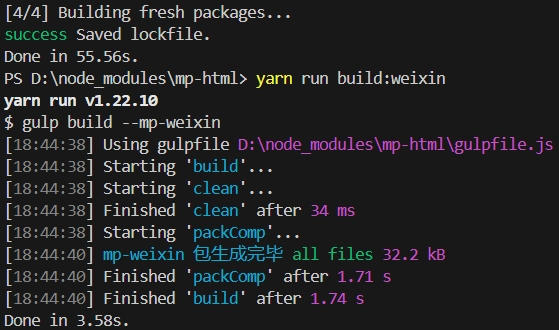

# 📌 插件 :id=plugin

> 可以在这里选择需要的插件以实现更加丰富的功能

## 使用插件 :id=use

!> 直接将插件文件夹拷贝到组件包中无法生效，请通过以下方式生成包含扩展的组件包

#### 小程序方式
?> 该方式适合不熟悉 *npm* 的用户

1. 通过 [小程序方式](overview/quickstart#mp) 获取包含扩展插件的组件包  
2. 将下载的组件包解压，原生小程序复制到 *components* 目录下，*uni-app* 复制到项目根目录下，按照源码方式引入即可，详见 [引入方式](overview/quickstart#use)

#### npm 方式

1. 获取完整的组件包  
   通过 [npm](overview/quickstart#npm) 或 [git](overview/quickstart#git) 等方式获取 **包含完整项目** 的组件包（注意从 *uni-app* 的插件市场中导入的包中仅包含构建后的组件，**不包含** 构建工具和插件）  
   
2. 选择需要的插件  
   参考下方插件使用说明，确定要使用的插件，将其名称填入 [tools/config.js](https://github.com/jin-yufeng/mp-html/blob/master/tools/config.js#L8) 中的 *plugins* 中  
   如果想仅在部分平台使用该插件，可以在该插件目录下的 *build.js* 的 *platform* 字段中填入需要的平台名称  
   
3. 生成组件包  
   设置完成后，可通过项目提供的命令行工具生成新的组件包，具体见 [生成组件包](advanced/develop#pack)  
     
   
4. 按照源码或 *npm* 方式引入构建后的组件包进行使用即可，详见 [引入方式](overview/quickstart#use)

## audio
功能：音乐播放器  
大小：*≈4KB*  
支持平台：  

| 微信小程序 | QQ 小程序 | 百度小程序 | 支付宝小程序 | 头条小程序 | uni-app |
|:---:|:---:|:---:|:---:|:---:|:---:|
| √ | √ | √ | √ | √ | √(nvue 不支持) |

!> 百度小程序原生包在此 [问题](https://smartprogram.baidu.com/forum/topic/show/125787) 未解决前无法使用  

说明：  
在大多数小程序平台，*audio* 标签已被废弃或无法使用，本插件可以代替 *audio* 标签播放音乐，并实现以下优化：  
1. [pause-video](basic/prop#pause-video) 属性也可以应用于音频，即播放一个音视频时可以自动暂停其他正在播放的音视频  
2. 增加了一个可以拖动的进度条  
3. 组件大小可以根据页面宽度自动调整  
4. 支持 *autoplay* 属性  
5. 播放被后台打断时，页面显示后自动继续播放  

基础库要求：  
支付宝 *1.23.4+* ，其余平台满足 [最低要求](question/faq#lib) 即可  
第 *5* 条仅微信 *2.2.3+* 、*QQ*、百度支持  

?> 如果希望页面上使用本组件，组件的路径为 *path/to/mp-html/audio/audio*  
属性和事件基本同 *audio* 组件，组件实例上提供了 *setSrc*、*play*、*seek*、*pause*、*stop* 方法可供控制播放状态  

## editable
功能：富文本编辑  
下表列出了本插件与原生 *editor* 组件的功能差异，可按需选用

| 组件 | 优点 | 缺点 |
|:---:|:---:|:---:|
| 原生 *editor* | 底层通过 *contenteditable* 实现，编辑流畅 | 支持标签少（不支持音视频、表格以及 *section* 等常用标签）、部分小程序平台不支持或低版本不兼容 |
| 本插件 | 支持标签全面、支持平台全面 | 编辑灵活性不够强 |

大小：*≈17.5KB*  
支持平台：  

| 微信小程序 | QQ 小程序 | 百度小程序 | 支付宝小程序 | 头条小程序 | uni-app |
|:---:|:---:|:---:|:---:|:---:|:---:|
| √ | √ | √ | √ | √ | √(nvue 不支持) |

##### 示例项目 :id=editable_demo
微信小程序点击 [代码片段](https://developers.weixin.qq.com/s/S2ZpZDm87fQP) 即可在微信开发者工具中导入；*uni-app* 下载 [示例项目](https://mp-html.oss-cn-hangzhou.aliyuncs.com/editable.zip) 在 *HBuilder X* 中打开即可体验；注意示例项目中不一定包含最新版本，仅供参考使用方法  

?> 也可以参考示例小程序 [源代码](https://github.com/jin-yufeng/mp-html-demo)

说明：  
引入本插件后，会给组件添加以下属性：  

| 属性名 | 类型 | 默认值 | 说明 |
|:---:|:---:|:---:|:---:|
| editable | Boolean | false | 是否开启内容编辑 |
| placeholder | String | 请输入 | 输入框为空时占位符（[2.1.0+](changelog/changelog#v210)） |

?> [2.5.0](changelog/changelog#v250) 版本起支持将 *editable* 属性设置为 *"simple"* 来开启简易模式，简易模式下，点击文字内容直接进入编辑，不再弹出操作菜单栏和方框

添加以下事件：  

| 事件名 | 触发时机 | 用途 |
|:---:|:---:|:---:|
| remove（[2.2.0+](changelog/changelog#v220)） | 删除图片/视频/音频标签时 | 删除已上传的线上文件 |

支持以下操作：  

| 类型 | 操作 |
|:---:|:---:|
| 文本 | 修改 |
| 图片 | 更换链接、调整宽度、设置成超链接（[2.0.4+](changelog/changelog#v204)）、设置预览图链接、禁用预览、删除 |
| 链接 | 更换链接、删除 |
| 音视频 | 设置封面、设置循环播放、设置自动播放（[2.2.0+](changelog/changelog#v220)）、删除 |
| 普通标签 | 设置字体大小、颜色（[2.4.2+](changelog/changelog#v242)）、斜体、粗体、下划线（[2.0.4+](changelog/changelog#v204)）、居中、缩进、删除 |

?> [2.2.1](changelog/changelog#v221) 版本起所有标签支持上下移动操作，但仅限同级标签间移动，即在有同级标签且非第一个（或最后一个）时可以上移（或下移）

?> 在支付宝小程序中使用时需要在页面样式中添加 *page { position: relative; }* 避免 *tooltip* 错位

?> 菜单项可以通过编辑 *plugins/editable/config.js* 进行修改，仅可以删减或调整顺序，添加或更名无效（颜色设置除外）

[组件实例](advanced/api#getCompent) 上提供了以下方法（*editable* 属性为 *true* 时才可以调用）：  

| 名称 | 功能 |
|:---:|:---:|
| undo | 撤销一个操作 |
| redo | 重做一个操作 |
| insertHtml | 在光标处插入指定 html 内容（[2.1.0+](changelog/changelog#v210)） |
| insertImg | 在光标处插入一张图片 |
| insertTable(rows, cols) | 在光标处插入一个 rows 行 cols 列的表格（[2.1.3+](changelog/changelog#v213)） |
| insertVideo | 在光标处插入一个视频 |
| insertAudio | 在光标处插入一个音频 |
| insertLink | 在光标处插入一个链接 |
| insertText | 在光标处插入一段文本 |
| clear | 清空内容 |
| getContent | 获取编辑后的 html 内容 |

?> 考虑到不同场景下希望获取链接的方法不同，需要在初始时给组件设置一个 *getSrc* 方法（否则插入图片、音视频、链接或修改链接等操作无法使用），每次组件内需要链接时会调用此方法，开发者可在此方法中自行决定如何获取链接，返回 **线上地址** 即可（具体用法见下方示例）  
[2.2.0](changelog/changelog#v220) 版本起设置了 [domain](basic/prop#domain) 属性时，返回的地址可以缺省主域名  

编辑完成后，通过 *getContent* 方法获取编辑后的 *html*，最后将 *editable* 属性设置为 *false* 即可正常渲染  

!> 点击保存按钮时，部分平台 *tap* 事件早于 *blur* 事件触发，直接获取内容可能导致无法获取当前编辑的文本内容，因此建议设置一个小的延时后获取（可参考下方示例，[详细](https://github.com/jin-yufeng/mp-html/issues/368)）  

示例：  
```javascript
Page({
  onLoad () {
    // ctx 为组件实例，获取方法见上
    /**
     * @description 设置获取链接的方法
     * @param {String} type 链接的类型（img/video/audio/link）
     * @param {String} value 修改链接时，这里会传入旧值
     * @returns {Promise} 返回线上地址（2.2.0 版本起设置了 domain 属性时，可以缺省主域名）
     *   type 为 audio/video 时，可以返回一个源地址数组
     *   2.1.3 版本起 type 为 audio 时，可以返回一个 object，包含 src、name、author、poster 等字段
     *   2.2.0 版本起 type 为 img 时，可以返回一个源地址数组，表示插入多张图片（修改链接时仅限一张）
     */
    this.ctx.getSrc = (type, value) => {
      return new Promise((resolve, reject) => {
        // 以图片为例
        if (type == 'img') {
          wx.chooseImage({
            count: value === undefined ? 9 : 1, // 2.2.0 版本起插入图片时支持多张（修改图片链接时仅限一张）
            success: res => {
              wx.showLoading({
                title: '上传中'
              });
              (async ()=>{
                const arr = []
                for (let item of res.tempFilePaths) {
                  // 依次上传
                  const src = await upload(item)
                  arr.push(src)
                }
                return arr
              })().then(res => {
                wx.hideLoading()
                resolve(res)
              })
            },
            fail: reject
          })
        }
      })
    }
  },
  finishEdit () {
    setTimeout(() => {
      var html = ctx.getContent() // 获取编辑好的 html
      // 上传 html
      wx.request({
        url: 'xxx',
        data: {
          html
        },
        success: () => {
          this.setData({
            editable: false // 结束编辑
          })
        }
      })
    }, 50)
  }
})
```

注意事项：  
不要在 *editable* 属性被设置为 *true* 前通过 [setContent](advanced/api#setContent) 方法（用 [content](basic/prop#content) 属性）设置内容，否则在切换为 *true* 后会变成空白  

## emoji
功能：解析 *emoji*  
大小：*≈3KB*  
支持平台：  

| 微信小程序 | QQ 小程序 | 百度小程序 | 支付宝小程序 | 头条小程序 | uni-app |
|:---:|:---:|:---:|:---:|:---:|:---:|
| √ | √ | √ | √ | √ | √ |

说明：  
将形如 *[笑脸]* 的文本替换为 *emoji* 字符 😄  
匹配模式可以通过修改 *reg* 变量实现  
默认配置了 *177* 个常用的 *emoji* 小表情，可以自行按照需要修改 *data* 变量  

?> 与 [editable](#editable) 插件共用时，导出编辑好的 *html* 内容，会将 *emoji* 字符编码为文本形式，便于存储  

## highlight
功能：代码块高亮显示  
大小：*≈16KB*  
支持平台：  

| 微信小程序 | QQ 小程序 | 百度小程序 | 支付宝小程序 | 头条小程序 | uni-app |
|:---:|:---:|:---:|:---:|:---:|:---:|
| √ | √ | √ | √ | √ | √ |

说明：  
编辑 *plugins/highlight/config.js* ，可以选择是否需要以下功能：  
- *copyByLongPress* 是否需要长按代码块时显示复制代码内容菜单（*uni-app nvue* 暂不支持）  
- *showLanguageName* 是否在代码块右上角显示语言的名称  
- *showLineNumber* 是否在左侧显示行号  

!> 修改该配置后需要重新 [生成组件包](advanced/develop#pack)，在构建后的组件包中修改配置无法生效

引入本插件后，*html* 中符合以下格式的 *pre* 将被高亮处理：  
```html
<!-- pre 中内含一个 code，并在 pre 或 code 的 class 中设置 language- -->
<pre><code class="language-css">p { color: red }</code></pre>
```

?> 与 [editable](#editable) 插件共用时，编辑状态下，不会进行高亮，可以直接修改代码文本

?> 本插件的高亮功能依赖于 [prismjs](https://prismjs.com/)，默认配置中仅支持 *html*、*css*、*c-like*、*javascript* 语言和 *Tomorrow Night* 主题，如果需要更多语言或更换主题请前往 [官网](https://prismjs.com/download.html) 下载对应的 *prism.min.js* 和 *prism.css* 并替换 *plugins/highlight/* 目录下的文件（*prismjs* 的插件大多涉及 *dom* 操作，基本不可用，请勿选择）  

## markdown
功能：渲染 *markdown*  
大小：*≈37KB*  
支持平台：  

| 微信小程序 | QQ 小程序 | 百度小程序 | 支付宝小程序 | 头条小程序 | uni-app |
|:---:|:---:|:---:|:---:|:---:|:---:|
| √ | √ | √ | √ | √ | √ |

说明：  
引入本插件后，会给组件添加一个 *markdown* 属性，将该属性设置为 *true* 后，即可通过 [content](basic/prop#content) 属性或 [setContent](advanced/api#setContent) 方法设置 *markdown* 内容即可  

?> 若开启 [use-anchor](basic/prop#use-anchor) 属性，所有标题 `# xxx` 都会被设置为锚点，通过链接 `[xxx](#xxx)` 可以直接跳转  

?> 本插件通过 [marked](https://github.com/markedjs/marked) 解析 *markdown* 文本，部分 *css* 摘选自 [github-markdown-css](https://github.com/sindresorhus/github-markdown-css)  

?> 本插件可以和 [highlight](#highlight) 插件共用，实现 *markdown* 中代码块的高亮效果  

## search
功能：关键词搜索  
大小：*≈1.5KB*  
支持平台：  

| 微信小程序 | QQ 小程序 | 百度小程序 | 支付宝小程序 | 头条小程序 | uni-app |
|:---:|:---:|:---:|:---:|:---:|:---:|
| √ | √ | √ | √ | √ | √(nvue 不支持) |

说明：  
引入后会在 [组件实例](advanced/api#getCompent) 上挂载一个 *search* 方法，用于关键词搜索  

输入值  

| 参数名 | 类型 | 默认值 | 说明 |
|:---:|:---:|:---:|---|
| key | String 或 RegExp | - | 要搜索的关键词，支持字符串和正则 |
| anchor | Boolean | false | 是否将搜索结果设置为锚点 |
| style | String | background-color:yellow | 标记搜索结果的样式 |

返回值：*Promise*    

| 属性 | 类型 | 说明 |
|:---:|:---:|---|
| num | Number | 搜索结果数量 |
| highlight | Function(i, style='background-color:#FF9632') | 高亮第 i（1 ~ num）个结果，将其样式设置为 style |
| jump | Function(i, offset) | 跳转到第 i（1 ~ num）个结果，偏移量为 offset，anchor 为 true 才可用 |

示例：  
```javascript
function search (key) {
  // ctx 为组件实例
  ctx.search(key, true).then(res => {
    res.highlight(1)
    res.jump(1, -50) // 高亮第 1 个结果并跳转到该位置，偏移量 -50
  })
}
```

?> 具体用法可以参考示例小程序 [源代码](https://github.com/jin-yufeng/mp-html-demo)

附加说明：  
1. 不传入 *key*（或为空）时即可取消搜索，取消所有的高亮，还原到原来的效果  
2. 进行新的搜索时旧的搜索结果将被还原，旧的结果中的 *highlight* 等方法不再可用  
3. 调用 *highlight* 方法高亮一个结果时，之前被高亮的结果会被还原，即始终只有一个结果被高亮  
4. *key* 传入字符串时大小写敏感，如果要忽略大小写可以用正则的 *i*（字符串搜索效率高于正则）  
5. 设置 *anchor* 为 *true* 会一定程度上降低效率，非必要不要开启  
6. 暂不支持跨标签搜索，即只有一个文本节点内包含整个关键词才能被搜索到  

## style
功能：解析和匹配 *style* 标签中的样式  

?> 这里的 *style* 标签指的是传入 [content](basic/prop#content) 属性中的 *html* 里包含的 *style* 标签，且 *style* 标签要放在其他标签前面才能生效  

大小：*≈3.5KB*  
支持平台：  

| 微信小程序 | QQ 小程序 | 百度小程序 | 支付宝小程序 | 头条小程序 | uni-app |
|:---:|:---:|:---:|:---:|:---:|:---:|
| √ | √ | √ | √ | √ | √ (nvue 直接支持) |

说明：  
支持以下选择器：  

| 名称 | 示例 |
|:---:|---|
| 标签名选择器 | p {} |
| class 选择器 | .class {} |
| id 选择器 | #id {} |
| 多选择器交集 | p.class {} |
| 多选择器并集 | p, .class {} |
| 后代选择器 | .class1 .class2 {} |
| 子选择器 | .class1 > .class2 {} |
| 伪类 | .class::before {} |

伪类仅支持 *before* 和 *after*，支持 *attr* 方法  
不支持的选择器（属性选择器等）将被忽略  

!> 由于小程序中无法动态写入 *css*，本插件的实现原理是通过解析，将匹配的样式添加到各标签的行内 *style* 中去，请慎用宽泛的选择器，以免大大增加解析结果大小，减慢渲染速度  

## txv-video
功能：使用腾讯视频  
大小：*≈1KB*  
支持平台：  

| 微信小程序 | QQ 小程序 | 百度小程序 | 支付宝小程序 | 头条小程序 | uni-app |
|:---:|:---:|:---:|:---:|:---:|:---:|
| √ | √ |   |   |   | √ (h5 和 app 直接支持) |

说明：  
引入本插件后，*html* 中符合下方格式的 *iframe* 标签（*src* 中含有 *vid*）将被转为通过腾讯视频播放：  
```html
<iframe src="https://v.qq.com/txp/iframe/player.html?vid=xxxxxx" allowFullScreen="true"></iframe>
```

同时，其可以被 [pause-video](basic/prop#pause-video) 属性控制  

!> 本插件仅用于将官方 [腾讯视频插件](https://github.com/tvfe/txv-miniprogram-plugin) 应用于本组件，使用前请确认已经成功申请使用该插件并按要求在小程序 *app.json* 中配置完成（*uni-app* 中的配置方法可以参考 [#103](https://github.com/jin-yufeng/mp-html/issues/103#issuecomment-654586246)），否则可能报错 **This application has not registered any plugins yet** 且无法生效  

?> 腾讯视频插件 [v2](https://github.com/tvfe/txv-miniprogram-plugin) 默认自动播放，[v1](https://github.com/tvfe/txv-miniprogram-plugin/blob/master/archieve/readme.md) 不会，可按需选择  

## img-cache
功能：图片本地缓存  
大小：*≈4KB*  
作者：[@PentaTea](https://github.com/PentaTea)  
支持平台：  

| 微信小程序 | QQ 小程序 | 百度小程序 | 支付宝小程序 | 头条小程序 | uni-app |
|:---:|:---:|:---:|:---:|:---:|:---:|
|  |  |  |  |  | √(仅支持 app 的 vue 页面) |

说明：  
引入本插件后，会给组件添加一个 *img-cache* 属性，将该属性设置为 *true* 后，将自动下载引用的图片并将 *src* 属性更换为本地地址  
同时在 [组件实例](advanced/api#getCompent) 上挂载了 *imgCache* 对象，扩充缓存控制能力  

*imgCache* 对象属性和方法：  

| 属性 | 功能 |
|:---:|:---:|
| list | 当前缓存的 url 列表 |
| get(url) | 传入 url 获得本地地址 |
| delete(url) | 传入 url 删除缓存记录 |
| add(url) | 传入 url 并下载目标为缓存 |
| clear() | 清空所有缓存 |

!> 请尽量确保 *src* 中含有文件后缀名，不以后缀结尾也没关系，插件会从路径中推测合理的图片后缀，如果完全不包含后缀信息可能会无法保存到相册  

## latex
功能：渲染 *latex* 公式  
大小：**≈300KB**  
作者：[@Zeng-J](https://github.com/Zeng-J)  
支持平台：  

| 微信小程序 | QQ 小程序 | 百度小程序 | 支付宝小程序 | 头条小程序 | uni-app |
|:---:|:---:|:---:|:---:|:---:|:---:|
| √ | √ | √ | √ | √ | √ |

说明：  
引入本插件后，会将 *$xxx$* 的文本内容按照 *latex* 规则进行解析和渲染   

?> [2.5.0](changelog/changelog#v250) 版本起支持 *$$xxx$$* 形式的块级公式

?> 与 [editable](#editable) 插件共用时，编辑状态下，公式不会渲染，可以直接修改公式文本

?> 在 *js* 的字符串中写 *latex* 公式时需注意 *\\* 会变成转义符，要使用 *\\\\* 或 *String.raw``* 的方式

?> 本插件通过 [katex-mini](https://github.com/rojer95/katex-mini) 解析 *latex* 文本，[字体文件](https://github.com/KaTeX/KaTeX/tree/main/fonts) 建议自行转存  

## card
功能：商品（联络人）信息卡  
大小：*≈7KB*  
作者：[@whoooami](https://github.com/whoooami)  
支持平台：  

| 微信小程序 | QQ 小程序 | 百度小程序 | 支付宝小程序 | 头条小程序 | uni-app |
|:---:|:---:|:---:|:---:|:---:|:---:|
| √ | √ | √ | √ | √ | √(nvue 不支持) |

效果图：  


参数列表：  

|参数名|是否必须|类型|说明|
|:---- |:---|:----- |----- |
|src|是|String|图片Url|
|title|是|String|标题|
|desc|是|String|描述|
|url|是|String|跳转url|
|color|是|String|文字颜色|
|bgcolor|是|String|卡片背景颜色|
|border|是|String|卡片边框颜色|

说明：  
1. 可以显示商品信息卡片/联络人信息卡片  

基础库要求：    
满足最低要求即可  

?> 如果希望页面上使用本组件，组件的路径为 *path/to/mp-html/card/card*  

## 开发插件 :id=develop
一个插件大致需要以下文件（*plugin/template* 中提供了一个模板） 

- *build.js*  
  构建文件，需要导出一个 *object*，可以内含以下项：  

  | 名称 | 类型 | 默认值 | 功能 |
  |:---:|:---:|:---:|---|
  | main | string | index.js | 入口文件路径 |
  | platform | string[] | ['mp-weixin', 'mp-qq', 'mp-baidu', 'mp-alipay', 'mp-toutiao', 'uni-app'] | 支持使用的平台 |
  | template | string | - | 要被添加到模板文件中的标签 (nvue 不可用) |
  | methods | object | {} | 用于处理模板中事件的方法 (nvue 不可用) |
  | style | string | - | 用于模板文件的 css 样式 |
  | import | string&#124;string[] | - | 用于模板文件的 css 文件路径 |
  | usingComponents | object | {} | 用于模板的组件或插件列表 (nvue 不可用) |
  | handler | function | - | 自定义文件处理方法 |


- *index.js*  
  入口文件，导出一个 *function*，每个组件在被创建时，会依次实例化各个插件，并传入组件实例可供调用  
  插件实例上可以挂载以下钩子方法，将在对应时机被调用  

  | 名称 | 触发时机 | 参数 | 返回值 |
  |:---:|:---:|:---:|:---:|
  | onUpdate | 更新 html 内容时触发 | 更新的 html 内容和解析配置 | 如果对输入值进行了修改，则返回修改后的内容 |
  | onParse | 解析到一个标签时触发 | 标签和解析器实例 | 返回 false 将移除该标签 |
  | onLoad | dom 树加载完成时触发 | - | - |
  | onDetached | 组件被移除时触发 | - | - |

- *README.md*  
使用说明  

- *其他依赖文件*  
插件目录下，除了 *.md* 的文件、*build.js* 和 *import* 字段中的 *css* 文件，其他的都会被拷贝到生成的组件包中，因此请不要放置无关文件  

对于仅在原生平台中使用的内容可放在 *miniprogram* 目录下，仅在 *uni-app* 中使用的内容可放在 *uni-app* 目录下，两个目录下可以分别放置 *build.js*  

如果在插件中需要用到解析器（将 *html* 字符串解析为 *nodes* 数组），可以引入 *src/parser.js* 使用，方法如下：  
```javascript
const Parser = require('../parser.js')
var instance = new Parser(vm) // 实例化解析器，传入组件实例将自动获取相关配置
var nodes = instance.parse(content) // 解析完成
```

!> 如果编写了插件，在升级组件包时请注意备份，避免丢失  

?> 欢迎提交实用的插件 [pull requests](https://github.com/jin-yufeng/mp-html/pulls) 到 *plugins* 文件夹  
